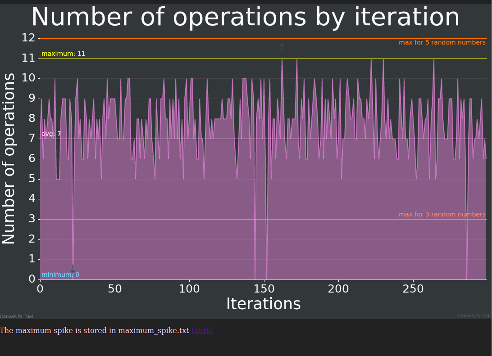

# ps\_tester
push\_swap operation counter

## Requirement
- you need to have a working checker. If you use the provided checker_OS, you need to rename it "checker".
- you need to have a `all` command in your makefile that compiles your push\_swap.

## Installation
get to your push\_swap repo then :
``git clone https://github.com/ChevalierSoft/ps_tester.git && cd ./ps_tester && make``

## Usage
### on linux
``./pt <size of the stack>``

### on mac
``./pt <size of the stack> && open index.html``

## notes
If you find that your push_swap uses too much operations, the maximum operation count is stored in `maximum_spike.txt`.
The final view is stored inside `index.hml` in ps_tester's root.
Notice that this programme will compile your code using `make`, not `make re` because checker is now a bonus.
